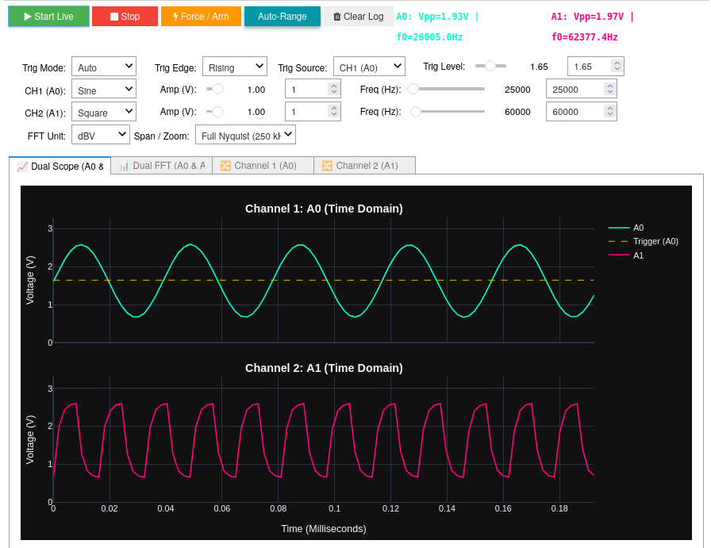
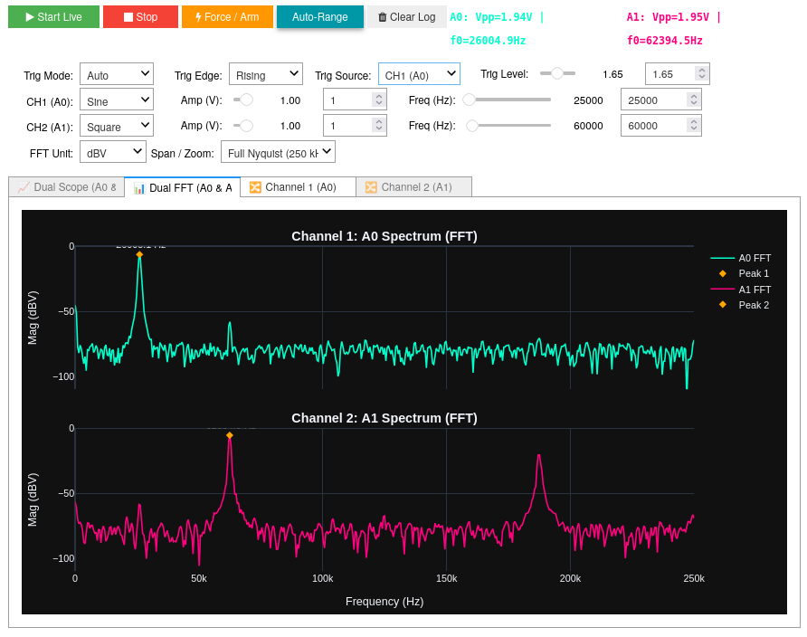
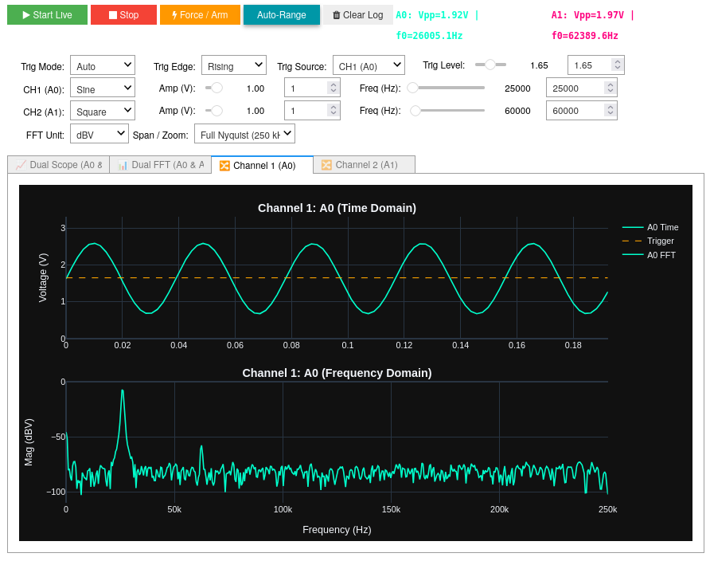
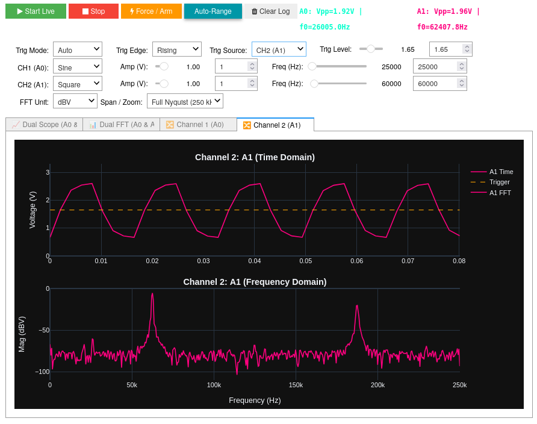
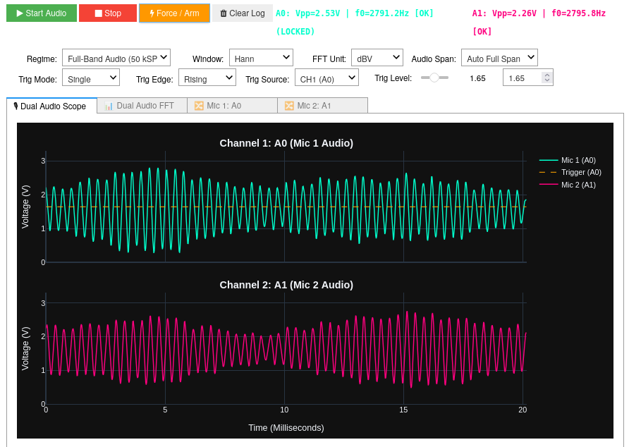
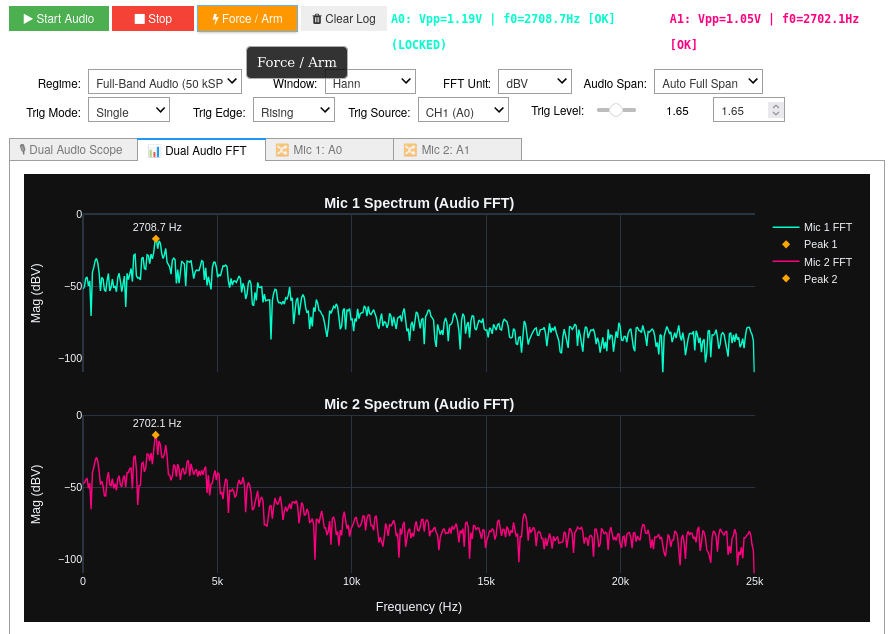
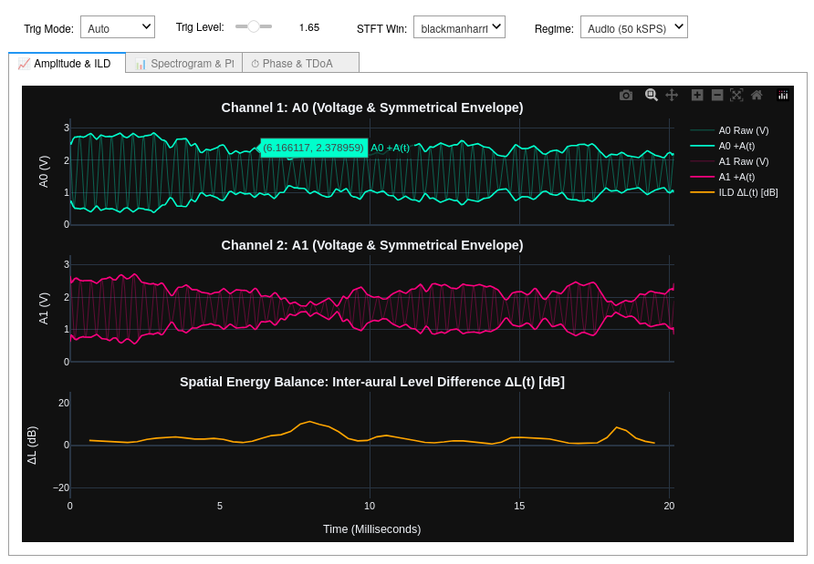
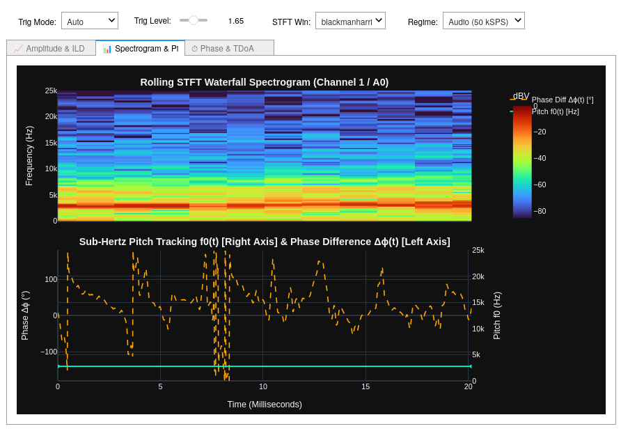

# Real-Time Dual-Channel Multi-Regime Oscilloscope & Audio Spectrum Analyzer

[](https://pypi.org/project/pynq-oscilloscope/)
[](https://github.com/SiririComun/sw-pynq-oscilloscope/blob/main/LICENSE)
[](https://github.com/SiririComun/hw-xadc-dma-overlays)
[](https://tul.com.tw/ProductsPYNQ-Z2.html)

A high-performance, dark-mode real-time **Dual-Channel Multi-Regime Oscilloscope, Audio Spectrum Analyzer, and Acoustic Analytics Engine** running natively on PYNQ Linux platforms.

Features **true simultaneous dual-ADC parallel sampling ($0.00\,\mu\text{s}$ inter-channel skew)**, **runtime-selectable operating regimes** (Wideband Lab Scope, Full Audio, Speech, Deep Bass Zoom), **FPGA-accelerated anti-aliasing decimation ($M \in \{1, 10, 20, 50\}$)**, **wideband $10\,\text{Hz} - 1\,\text{MHz}$ signal generation with interactive Nyquist folding/aliasing exploration**, sub-sample trigger phase-locking, **dedicated passive microphone instruments (`AudioDashboard`)**, **Hilbert analytic envelopes**, **STFT waterfall spectrograms**, sub-Hertz quadratic pitch tracking, and direct Jupyter audio playback (`ol.play_audio()`).

---

## 🏛 System Architecture

This repository adopts the **canonical PYNQ Custom Overlay pattern** (`OscilloscopeOverlay`). It automatically pulls its compiled hardware bitstream and metadata from GitHub Releases (or loads local custom `.bit` builds) and encapsulates the Dual DMA receivers, AXI-Lite trigger registers, sequencer controls, dynamic decimators, and dual-wavegen into a unified Python object.

```
 [ Analog Discovery 3 ] ──(W1: Yellow)──────> [ PYNQ-Z2 Pin A0 (Vaux1) ]
 [      Wavegen       ] ──(W2: Yellow/White)─> [ PYNQ-Z2 Pin A1 (Vaux9) ]
 [         OR         ]                                       │
 [ MAX4466 Mics A0/A1 ]                       (XADC Dual Continuous Sequencer)
        │                                                     │ (1 MSPS Interleaved Stream, 0.00 µs Skew)
  (pydwf SDK)                                                 ▼
        │                                            [ axis_trigger_unit IP ]
        ▼                                      (Selectable Trigger Source: A0 / A1)
 [ AD3SignalGenerator ]                                       │ (Gated Stream)
 (Concurrent W1 & W2)                                         ▼
                                                     [ axis_decimator IP ]
                                           (Programmable M = 1, 10, 20, 50 in PL)
                                                              │ (Decimated Stream)
                                                              ▼
                                                     [ tlast_generator (Programmable N) ]
                                                              │ (w/ TLAST)
                                                     [ axis_broadcaster ]
                                               ┌──────────────┴──────────────┐
                                               ▼ (Decimated Time Stream)     ▼ (Interleaved Stream w/ TLAST)
                                      [ AXI DMA 0 (Time) ]          [ axis_channel_demux ]
                                               │                             │ (Clean A0 vs A1 Routing)
                                               │                             ▼
                                               │                    [ xfft Core (Runtime N FFT) ]
                                               │                             │ (Complex Re + j*Im)
                                               │                             ▼
                                               │                    [ CORDIC (Magnitude Engine) ]
                                               │                             │
                                               │                    [ AXI DMA 1 (FFT) ]
                                               │                             │
                                               └──────────────┬──────────────┘
                                                              ▼
                                                   [ OscilloscopeOverlay ]
                                            ├── .trigger          (HardwareTrigger AXI-Lite)
                                            ├── .xadc             (StreamingXADC DMA Driver)
                                            ├── .fft              (StreamingFFT PL DMA Driver)
                                            ├── .wavegen          (AD3SignalGenerator Dual-DAC)
                                            ├── .set_profile()    (Multi-Regime Runtime Switcher)
                                            ├── .play_audio()     (Jupyter Audio Playback)
                                            ├── .ad3_dashboard()  (Academic Lab Scope UI: 10 Hz - 1 MHz)
                                            ├── .audio_dashboard()(Dedicated Passive Microphone UI)
                                            └── .analytic_dashboard() (Acoustic Diagnostics & Spectrograms)
```

---

## 🎛 Multi-Regime Operating Profiles

The system seamlessly reconfigures sampling rate, packet duration, and FFT resolution on the fly via `ol.set_profile()`:

| Profile Name | Decimator ($M$) | Transform ($N$) | Sampling Rate ($f_s$) | Nyquist Bandwidth | Time Window ($T_{\text{win}}$) | Resolution ($\Delta f$) | Best Used For |
| :--- | :---: | :---: | :---: | :---: | :---: | :---: | :--- |
| **`oscilloscope`** | **$1$** (Bypass) | $2048$ | $500\,\text{kSPS}$ | $0 - 250\,\text{kHz}$ | $2.05\,\text{ms}$ | $244.14\,\text{Hz}$ | Function generators, high-speed pulses, logic edges |
| **`audio`** | **$10$** | $2048$ | $50\,\text{kSPS}$ | $0 - 25\,\text{kHz}$ | $40.96\,\text{ms}$ | $24.41\,\text{Hz}$ | Full-spectrum music, instruments, acoustic speech |
| **`speech`** | **$20$** | $2048$ | $25\,\text{kSPS}$ | $0 - 12.5\,\text{kHz}$ | $81.92\,\text{ms}$ | $12.21\,\text{Hz}$ | Vocal formants, acoustic resonance |
| **`bass_zoom`** | **$50$** | $2048$ | $10\,\text{kSPS}$ | $0 - 5\,\text{kHz}$ | $204.80\,\text{ms}$ | **$4.88\,\text{Hz}$** | Deep sub-bass ($20-100\,\text{Hz}$), room acoustic analysis |

---

## 🖥 3-Tier Interactive Instrument Suite

### 1. Academic Laboratory Dual Scope & Aliasing Explorer (`ol.ad3_dashboard()`)
Full-featured oscilloscope with live Analog Discovery 3 signal generation ($10\,\text{Hz} - 1\,\text{MHz}$) and $250\,\text{kHz}$ Nyquist span. Allows students to dial beyond $250\,\text{kHz}$ ($300\,\text{kHz}, 450\,\text{kHz}, 800\,\text{kHz}$) to observe real-time spectral folding/aliasing.

| Dual Time-Domain Scope (A0 & A1) | Dual FFT Spectrum Analyzer (0 to 250 kHz) |
| :---: | :---: |
|  |  |

| Dedicated Channel 1 View (A0) | Dedicated Channel 2 View (A1) |
| :---: | :---: |
|  |  |

---

### 2. Dedicated Microphone & Audio Instrument (`ol.audio_dashboard()`)
Designed specifically for passive **MAX4466 electret microphones** (or any analog audio sensor on pins **A0** and **A1**), running completely independently without requiring an Analog Discovery 3:
* **$40.96\,\text{ms} - 204.8\,\text{ms}$ Audio Timebase:** Displays multi-cycle acoustic waveforms for speech, musical instruments, and bass frequencies ($20\,\text{Hz} - 250\,\text{Hz}$).
* **Live VU Meters & Clipping Alerts:** Status bar indicators that flash red if either microphone saturates ($V < 0.10\,\text{V}$ or $V > 3.10\,\text{V}$).
* **Sub-Bin Quadratic Peak Pitch Tracking:** Extracts the dominant acoustic fundamental ($f_0$) with $\pm 0.5\,\text{Hz}$ accuracy.

| Dual Audio Waveforms (Mic 1 & Mic 2) | Dual Audio Spectrum (0 to 25 kHz) |
| :---: | :---: |
|  |  |

---

### 3. Multi-Domain Acoustic Analytics & Spectrogram Engine (`ol.analytic_dashboard()`)
Advanced diagnostic instrument providing instantaneous mathematical decomposition of stereo sound fields:
* **3-Strip Stacked Amplitude:** Instantaneous physical Hilbert analytic envelopes ($A(t) = \sqrt{x^2 + \hat{x}^2}$) and Inter-aural Level Differences ($\Delta L(t)$ in dB).
* **Rolling STFT Waterfall Spectrogram:** 2D time-frequency heatmaps with Blackman-Harris windowing.
* **Continuous Phase Tracking ($\Delta \phi(t)$):** Instantaneous inter-channel phase alignment enabled by true simultaneous dual-ADC sampling ($0.00\,\mu\text{s}$ skew).

| 3-Strip Stacked Amplitude & ILD Balance | STFT Waterfall Spectrogram & Phase Tracking |
| :---: | :---: |
|  |  |

---

## 🔌 Hardware Setup & Wiring

### Option A: Dual MAX4466 Microphones (Acoustic Audio Mode)
| MAX4466 Pin | PYNQ-Z2 Connection | Description |
| :--- | :--- | :--- |
| **`VCC`** | **`3.3V`** (Power Header) | Supply rail ($2.4\,\text{V} - 5.5\,\text{V}$) |
| **`GND`** | **`GND`** (Power Header) | Common analog ground |
| **`OUT` (Mic 1)** | **Header `J1` Pin A0** | Channel 1 Audio Input ($1.65\,\text{V}$ resting bias) |
| **`OUT` (Mic 2)** | **Header `J1` Pin A1** | Channel 2 Audio Input ($1.65\,\text{V}$ resting bias) |

### Option B: Analog Discovery 3 (Signal Generator Mode)
| AD3 Wire | Wire Color | PYNQ-Z2 Analog Pin | Signal Description |
| :--- | :--- | :--- | :--- |
| **Wavegen 1 (W1)** | Solid Yellow | **Header `J1` Pin A0** (Pin 6 - Bottom) | Channel 1 Analog Input (`Vaux1`) |
| **Wavegen 2 (W2)** | Yellow / White Stripe | **Header `J1` Pin A1** (Pin 5 - 2nd from Bottom) | Channel 2 Analog Input (`Vaux9`) |
| **GND** | Solid Black | **PYNQ-Z2 GND** | Common Analog Reference |

*Note: Connect the AD3 USB cable to the large rectangular **USB HOST** port on the PYNQ-Z2 board. Use an external 5V auxiliary power supply for the AD3 to ensure voltage rail stability under dual-channel generation.*

---

## 🚀 Quick Start & Installation

### 1. Install Package from PyPI
```bash
pip install --upgrade pynq-oscilloscope
```

### 2. Copy Example Notebooks to Jupyter Workspace
```bash
pynq-oscilloscope-get-notebooks
```

### 3. Install Digilent AD3 Drivers (One-Time Setup for Wavegen)
```python
from pynq_oscilloscope import install_ad3_drivers
install_ad3_drivers()
```

---

## 💻 Python API Usage

### 1. Multi-Regime Profile Switching & Capture
```python
from pynq_oscilloscope import check_usb_permissions, OscilloscopeOverlay

check_usb_permissions()

# Load hardware overlay (auto-fetches v1.5.0 bitstream)
ol = OscilloscopeOverlay()

# 1. Switch to Full Audio Mode (50 kSPS, 40.96 ms frame)
ol.set_profile("audio")
v_a0, v_a1 = ol.capture_stereo()
print(f"Captured Audio: A0 Vpp={v_a0.max()-v_a0.min():.2f}V | A1 Vpp={v_a1.max()-v_a1.min():.2f}V")

# 2. Switch to Deep Bass Zoom Mode (10 kSPS, Δf = 4.88 Hz, 204.8 ms frame)
ol.set_profile("bass_zoom")

# 3. Switch back to High-Speed Lab Scope (500 kSPS, 0 - 250 kHz)
ol.set_profile("oscilloscope")
```

### 2. Jupyter Audio Playback
```python
# Record and listen to microphone audio directly in Jupyter Notebook
ol.set_profile("audio")
ol.play_audio(channel=1) # Plays Channel 1 (A0)
```

### 3. Launch Interactive Dashboards
```python
# Launch Academic Lab Scope & AD3 Aliasing Explorer:
app = ol.ad3_dashboard()

# Launch dedicated passive Microphone Instrument:
app = ol.audio_dashboard()

# Launch Multi-Domain Acoustic Analytics Engine:
app = ol.analytic_dashboard()
```

---

## 📓 5-Notebook Progressive Suite

| Notebook | Focus Area | Key Modules Used |
| :--- | :--- | :--- |
| **`01_ad3_getting_started.ipynb`** | Digilent drivers, USB permissions, and dual non-blocking signal generator. | `AD3SignalGenerator`, `check_usb_permissions` |
| **`02_xadc_getting_started.ipynb`** | Low-level 1 MSPS DMA stream capture, hardware trigger comparator, and DDR transfer. | `OscilloscopeOverlay`, `HardwareTrigger` |
| **`03_ad3_oscilloscope_dashboard.ipynb`** | **Academic Lab Scope:** Dual-trace scope, $10\,\text{Hz} - 1\,\text{MHz}$ wavegen, and live aliasing folding exploration. | `OscilloscopeOverlay`, `OscilloscopeDashboard` |
| **`04_audio_dashboard.ipynb`** | **Audio Instrument:** Dedicated passive microphone analyzer with VU meters & overtone pitch tracking. | `OscilloscopeOverlay`, `AudioDashboard` |
| **`05_acoustic_analytic_curves.ipynb`** | **Analytics Engine:** Zero-skew splitter test, Hilbert envelopes, ILD balance, and STFT waterfall spectrograms. | `OscilloscopeOverlay`, `AcousticAnalyticDashboard` |

---

## 📄 License

This project is licensed under the MIT License - see the [LICENSE](https://github.com/SiririComun/sw-pynq-oscilloscope/blob/main/LICENSE) file for details.